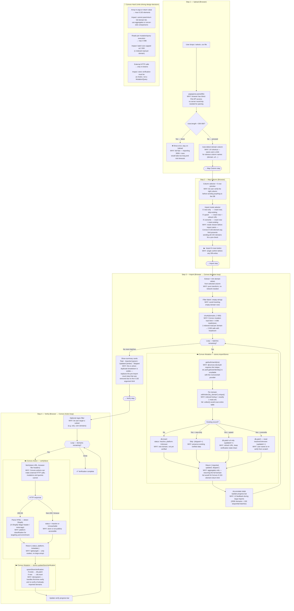

# CSV Import — Architecture Diagram

Flow: **Upload → Map Column → Import → Verify**

Each node is labelled with *what* happens and *why* it happens there.

```mermaid
flowchart TD

    %% ── STEP 1: UPLOAD ──────────────────────────────────────────────────────

    subgraph S1 ["Step 1 — Upload  (Browser)"]
        direction TB
        A["User drops / selects .csv file"]
        A --> B["papaparse.parse(file)\nWHY: browser has direct File API access;\nno server round-trip needed for parsing"]
        B --> C{"rows.length > 300 000?"}
        C -- "Yes → block" --> D["❌ Show error, stay on Upload\nWHY: fail fast — importing 300K+ rows\nwould take too long and risk timeouts"]
        C -- "No → proceed" --> E["Auto-detect domain column\nWHY: UX shortcut — saves user a click\nfor obvious column names (domain, url…)"]
        E --> STEP2
    end

    %% ── STEP 2: MAP COLUMN ──────────────────────────────────────────────────

    subgraph S2 ["Step 2 — Map Column  (Browser)"]
        direction TB
        STEP2(["→ Map Column step"])
        STEP2 --> F["Column selector + 5-row preview\nWHY: let user verify the right column\nbefore sending anything to the DB"]
        F --> G["Import mode selector\n① new-only   — insert new, skip existing\n② upsert     — insert new + refresh URL\n③ overwrite  — insert new + reset existing\nWHY: mode chosen before import starts —\nConvex 8 192-element arg limit prevents\nsending all CSV domains for a pre-check"]
        G --> H["▶  Import N rows button\nWHY: single confirm before any DB writes"]
        H --> STEP3
    end

    %% ── STEP 3: IMPORT (client loop) ────────────────────────────────────────

    subgraph S3 ["Step 3 — Import  (Browser → Convex Mutation loop)"]
        direction TB
        STEP3(["→ Import step"])
        STEP3 --> I["Extract + trim domain values\nfrom selected column\nWHY: pure transform, no network needed"]
        I --> J["Filter blank / empty strings\nWHY: avoid inserting empty domain rows"]
        J --> K["chunk(domains, 2 000)\nWHY: Convex mutation hard limit = 4 096 reads/exec;\n1 indexed read per domain → 2 000 safe with headroom"]
        K --> L{{"Loop — batches remaining?"}}
        L -- "Yes" --> MUT

        subgraph MUT ["☁️  Convex Mutation — stores.importStores"]
            direction TB
            M1["getAuthUserId(ctx)\nWHY: @convex-dev/auth requires this helper;\nctx.auth.getUserIdentity() is unreliable\nwith the ConvexAuth provider"]
            M1 --> M2["Per domain:\n.withIndex('by_domain').unique()\nWHY: indexed lookup = exactly 1 read unit;\nfull .collect() would scan entire table"]
            M2 --> M3{{"Existing record?"}}
            M3 -- "No" --> M4["db.insert\nstatus: Inactive, platform: Unknown\nWHY: new domain, not yet verified"]
            M3 -- "Yes + new-only" --> M5["Skip  (skipped++)\nWHY: preserve existing verified data"]
            M3 -- "Yes + upsert" --> M6["db.patch url only  (updated++)\nWHY: refresh URL, keep verification state intact"]
            M3 -- "Yes + overwrite" --> M7["db.patch — reset Inactive/Unknown  (updated++)\nWHY: user wants to re-verify from scratch"]
            M4 & M5 & M6 & M7 --> M8["Return { imported, updated, skipped }\nWHY: aggregates only — returning the full domain\nlist would hit Convex 8 192-element return limit"]
        end

        M8 --> N["Accumulate totals\nUpdate progress bar\nWHY: UI feedback during large imports\n(200K domains = 100 sequential batches)"]
        N --> L
        L -- "No more batches" --> O["Show summary cards\nTotal · Imported (green) · Updated (amber) · Skipped\nWHY: this is where duplicate breakdown is visible —\nreplaces the pre-import count step that was\nremoved due to the 8 192 argument limit"]
        O --> STEP4
    end

    %% ── STEP 4: VERIFY ──────────────────────────────────────────────────────

    subgraph S4 ["Step 4 — Verify  (Browser → Convex Action loop)"]
        direction TB
        STEP4(["→ Verify step"])
        STEP4 --> P["Optional regex filter\nWHY: let user target a subset\n(e.g. only .com domains)"]
        P --> Q{{"Loop — domains remaining?"}}
        Q -- "Yes" --> ACT

        subgraph ACT ["☁️  Convex Action — verifyStore"]
            direction TB
            A1["fetch(store URL, browser-like headers)\nWHY: Convex actions can make external HTTP calls;\nmutations and queries cannot"]
            A1 --> A2{{"HTTP response"}}
            A2 -- "200 OK" --> A3["Parse HTML — detect Shopify\n(X-Shopify-Stage header / meta tags)\nWHY: platform classification for\ntargeting and enrichment"]
            A2 -- "Non-200 / timeout" --> A4["status = Inactive or Unreachable\nWHY: store is not publicly accessible"]
            A3 & A4 --> A5["Return { status, platform, metadata }\nWHY: lightweight — only scalars, no large arrays"]
        end

        A5 --> MUT2

        subgraph MUT2 ["☁️  Convex Mutation — stores.updateStoreVerification"]
            direction TB
            B1["upsertStoreVerification:\nif exists → db.patch\nif new    → db.insert\nWHY: idempotent — handles first-time verify\nand re-verify of already-imported domains"]
        end

        B1 --> R["Update verify progress bar"]
        R --> Q
        Q -- "Done" --> Z["✅ Verification complete"]
    end

    %% ── CONVEX HARD LIMITS (reference) ──────────────────────────────────────

    subgraph LIMITS ["📏  Convex Hard Limits driving design decisions"]
        direction LR
        L1["Array in args or return value\n→ max 8 192 elements\n\nImpact: cannot pass/return full domain list;\nuse aggregates or server-side comparisons"]
        L2["Reads per mutation/query execution\n→ max 4 096\n\nImpact: batch size capped at 2 000\n(1 indexed read per domain)"]
        L3["External HTTP calls\n→ only in Actions\n\nImpact: store verification must be\nan Action, not a Mutation/Query"]
    end
```
